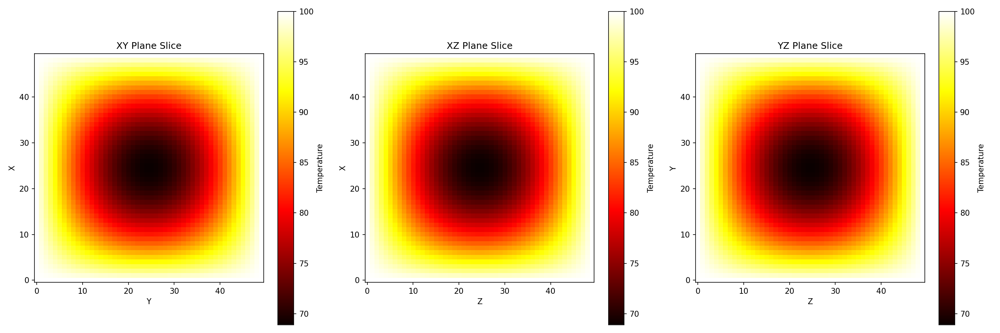
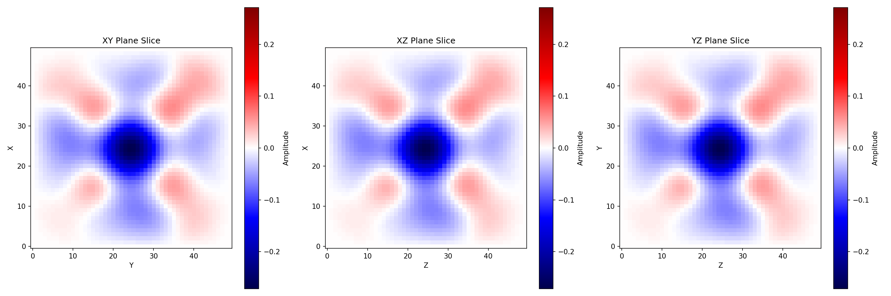

# PDE Solvers: High-Performance Numerical Solvers for Heat and Wave Equations



:-------------------------:|:-------------------------:



:-------------------------:|:-------------------------:

## Project Overview
This project implements parallelized 3D solvers for:
- **Heat Equation** (Diffusion equation)
- **Wave Equation** (Hyperbolic PDE)

Features:
- OpenMP parallelization for multi-core CPUs
- Optimized memory access patterns
- Physical boundary conditions
- Detailed visualization tools

## Requirements
- C++17 compatible compiler (GCC, Clang, MSVC)
- CMake (≥ 3.10)
- Python 3 (for visualization)
- OpenMP (usually included with compiler)

Python visualization packages:
```bash
pip install numpy matplotlib scikit-image
```

## Installation & Building
```bash
git clone https://github.com/sowmya8900/HPCProject.git
cd PDE_Solvers
mkdir build && cd build
cmake .. -DCMAKE_BUILD_TYPE=Release
make -j4
```

## Running the Solvers

### Heat Equation
```bash
# Serial version
./heat_solver

# Parallel version (4 threads)
export OMP_NUM_THREADS=4
./heat_solver
```

### Wave Equation
```bash
# Serial version
./wave_solver

# Parallel version (4 threads)
export OMP_NUM_THREADS=4
./wave_solver
```

### Output Files
Both solvers generate:
- Final state: <code>data/heat_final.txt</code> or <code>data/wave_final.txt</code>
- Time steps: <code>data/heat_step_\*.txt</code> and <code>data/wave_step_*.txt</code>

## Visualization
### Python Scripts
```bash
# Heat equation visualizations
python visualize_heat.py

# Wave equation visualizations
python visualize_wave.py
```

### Generated visualizations:
- 2D Slices (<code>*_slices.png</code>)
- 3D Isosurfaces (<code>*_3d.png</code>)
- Time Animations (<code>\*_diffusion.gif</code>, <code>*_propagation.gif</code>)

## Configuration Options
Modify these in the source files:
- Grid size (<code>grid_size</code>)
- Physical parameters (<code>alpha</code>, <code>c</code>)
- Time steps (<code>dt</code>, total iterations)
- Initial conditions

## Performance Tuning
- Adjust <code>OMP_NUM_THREADS</code> for your CPU cores
- Try different grid sizes (powers of 2 often perform better)

## Future Work
- Add MPI parallelization
- Implement adaptive mesh refinement
- Add GUI controls via web interface
- Machine learning for parameter optimization
